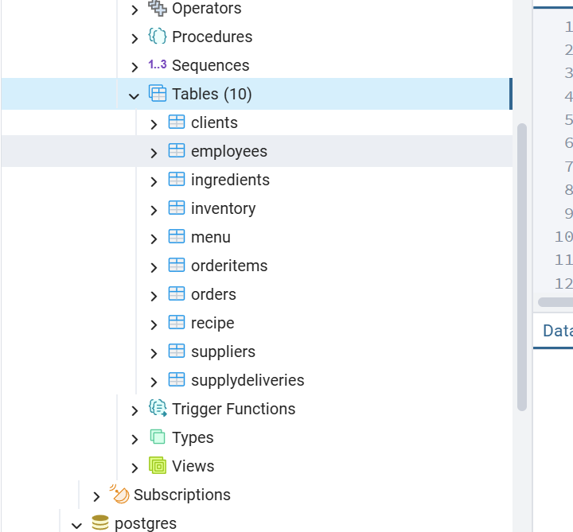
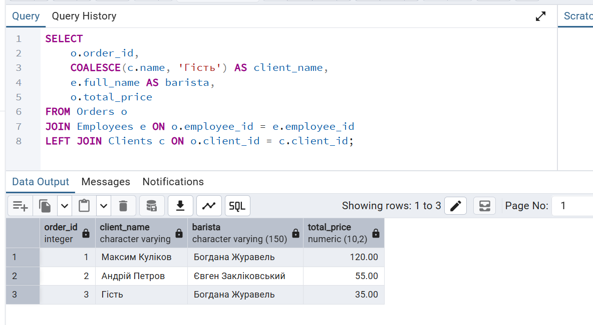
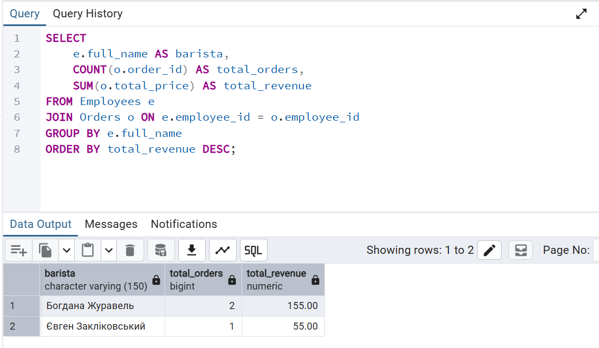
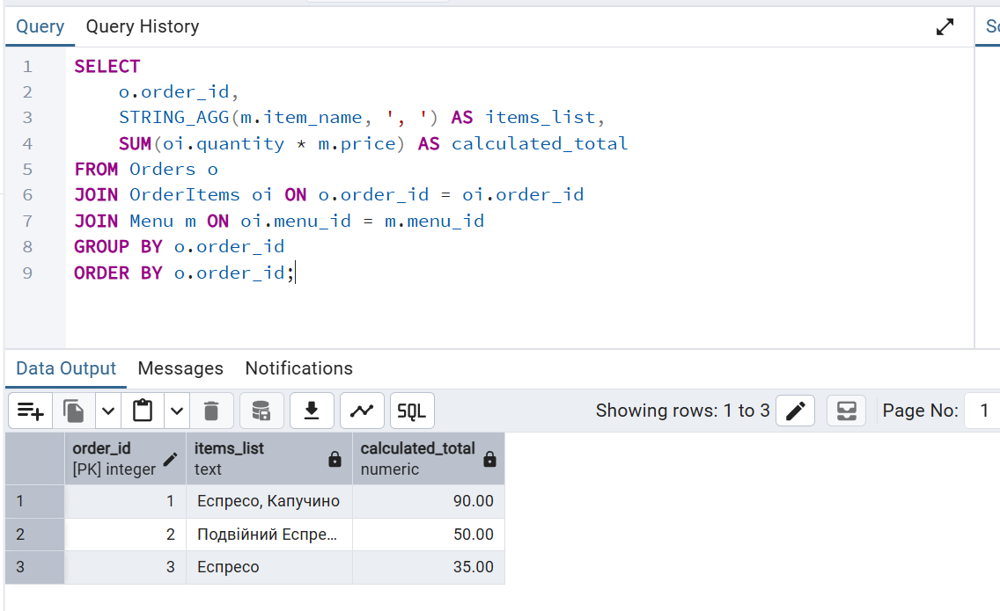

# Лабораторна робота №2

<div align="right">
<strong>Група:</strong> ІО-42

<strong>Виконали:</strong> Бушма Д. О.,
Журавель Б. О.,
Закліковський Є. Д.,
Куліков М. М.  

<strong>Перевірив:</strong> Русінов В. В.
</div>

## **Тема:** 
Перетворення ER-діаграми на схему PostgreSQL
## **Мета:** 
- Написати SQL DDL-інструкції для створення кожної таблиці з вашої ERD в PostgreSQL.
- Вказати відповідні типи даних для кожного стовпця, вибрати первинний ключ для кожної таблиці та визначити будь-які необхідні зовнішні ключі, обмеження UNIQUE, NOT NULL, CHECK або DEFAULT.
- Вставити зразки рядків (принаймні 3–5 рядків на таблицю) за допомогою INSERT INTO.
- Протестувати все в pgAdmin (або іншому клієнті PostgreSQL), щоб переконатися, що таблиці та дані завантажуються правильно.

## Виконання роботи
### Опис схеми бази даних

База даних призначена для зберігання інформації у кав'ярні. Реалізовуватимемо її у СУБД PostgreSQL

З попередньої лабораторної роботи маємо наступну ER-діаграму

<p align="center">
  <br>
  <i>Рисунок 1 – ER-діаграма бази даних кав’ярні</i>
</p>

### Реляційна схема бази даних

Clients(`client_id`, `name`, `phone`, `bonus_points`)   
Employees(`employee_id`, `full_name`, `position`, `hire_date`)  
Suppliers(`supplier_id`, `company_name`, `contact_phone`, `email`)  
Orders(`order_id`, `client_id`, `employee_id`, `created_at`, `total_price`)  
Menu(`menu_id`, `item_name`, `price`, `category`)  
Ingredients(`ingredient_id`, `name`, `unit`, `min_stock_level`)  
SupplyDeliveries(`delivery_id`, `supplier_id`, `employee_id`, `delivery_date`, `total_cost`)  
OrderItems(`item_id`, `order_id`, `menu_id`, `quantity`)  
Recipe(`recipe_id`, `menu_id`, `ingredient_id`, `quantity_required`)  
Inventory(`inventory_id`, `ingredient_id`, `quantity_in_stock`, `last_updated`, `storage_location`)

### Основні зв'язки між таблицями 
#### Процес продажу (Замовлення)
- Один Employee може оформити багато Orders.
- Один Client може робити багато Orders (опційно, `client_id` може бути `NULL` для «гостей»).
- Одне Order може містити багато Menu через OrderItems, а одна Menu може входити в багато Orders (N:M через OrderItems).

#### Склад страв (Рецептура)
- Одне Menu містить багато Ingredients через Recipe, а один Ingredient може входити до складу багатьох Menu (N:M через Recipe).
- Таблиця Recipe зберігає кількість інгредієнта для однієї порції страви.

#### Реалізація зв’язків
- Усі зв’язки типу 1:N реалізовані за допомогою зовнішніх ключів.
- Зв’язки N:M реалізовані через сполучні таблиці (OrderItems та Recipe).

### Реалізація у PostgreSQL
```
CREATE TABLE Employees (
    employee_id SERIAL PRIMARY KEY,
    full_name VARCHAR(150) NOT NULL,
    position VARCHAR(100) NOT NULL,
    hire_date DATE DEFAULT CURRENT_DATE
);

CREATE TABLE Clients (
    client_id SERIAL PRIMARY KEY,
    name VARCHAR(100) NOT NULL,
    phone VARCHAR(20) UNIQUE,
    bonus_points INT DEFAULT 0 CHECK (bonus_points >= 0)
); 

CREATE TABLE Suppliers (
    supplier_id SERIAL PRIMARY KEY,
    company_name VARCHAR(150) NOT NULL,
    contact_phone VARCHAR(20),
    email VARCHAR(100) UNIQUE
); 

CREATE TABLE Menu (
    menu_id SERIAL PRIMARY KEY,
    item_name VARCHAR(100) NOT NULL,
    price NUMERIC(10, 2) NOT NULL CHECK (price > 0),
    category VARCHAR(50)
); 

CREATE TABLE Ingredients (
    ingredient_id SERIAL PRIMARY KEY,
    name VARCHAR(100) NOT NULL,
    unit VARCHAR(20) NOT NULL,
    min_stock_level NUMERIC(10, 2) DEFAULT 0 CHECK (min_stock_level >= 0)
);

CREATE TABLE Orders (
    order_id SERIAL PRIMARY KEY,
    client_id INT REFERENCES Clients(client_id) ON DELETE SET NULL,
    employee_id INT NOT NULL REFERENCES Employees(employee_id),
    created_at TIMESTAMP DEFAULT CURRENT_TIMESTAMP,
    total_price NUMERIC(10, 2) DEFAULT 0 CHECK (total_price >= 0)
);

CREATE TABLE SupplyDeliveries (
    delivery_id SERIAL PRIMARY KEY,
    supplier_id INT NOT NULL REFERENCES Suppliers(supplier_id),
    employee_id INT NOT NULL REFERENCES Employees(employee_id),
    delivery_date DATE DEFAULT CURRENT_DATE,
    total_cost NUMERIC(10, 2) NOT NULL CHECK (total_cost >= 0)
);

CREATE TABLE OrderItems (
    item_id SERIAL PRIMARY KEY,
    order_id INT NOT NULL REFERENCES Orders(order_id) ON DELETE CASCADE,
    menu_id INT NOT NULL REFERENCES Menu(menu_id),
    quantity INT NOT NULL CHECK (quantity > 0)
);

CREATE TABLE Recipe (
    recipe_id SERIAL PRIMARY KEY,
    menu_id INT NOT NULL REFERENCES Menu(menu_id) ON DELETE CASCADE,
    ingredient_id INT NOT NULL REFERENCES Ingredients(ingredient_id),
    quantity_required NUMERIC(10, 2) NOT NULL CHECK (quantity_required > 0)
);

CREATE TABLE Inventory (
    inventory_id SERIAL PRIMARY KEY,
    ingredient_id INT NOT NULL UNIQUE REFERENCES Ingredients(ingredient_id) ON DELETE CASCADE,
    quantity_in_stock NUMERIC(10, 2) NOT NULL DEFAULT 0,
    last_updated TIMESTAMP DEFAULT CURRENT_TIMESTAMP,
    storage_location VARCHAR(100)
);


INSERT INTO Employees (full_name, position, hire_date) VALUES 
('Дарина Бушма', 'Менеджер', '2023-01-15'),
('Богдана Журавель', 'Бариста', '2023-05-20'),
('Євген Закліковський', 'Бариста', '2023-06-10'),
('Вікторія Біла', 'Кондитер', '2023-03-10'); 

INSERT INTO Clients (name, phone, bonus_points) VALUES 
('Максим Куліков', '+380671112233', 150),
('Андрій Петров', '+380934445566', 10),
('Марія Сидоренко', '+380507778899', 20),
('Наталія Савченко', '0936665544', 120); 

INSERT INTO Suppliers (company_name, contact_phone, email) VALUES 
('Світ кави', '+380445556677', 'info@coffeeworld.ua'),
('Молочний шлях', '+380441112233', 'sales@milkway.com'),
('Цукровий завод', '+380449998877', 'sugar@plant.ua');

INSERT INTO Menu (item_name, price, category) VALUES 
('Еспресо', 35.00, 'Кава'),
('Подвійний Еспресо', 50.00, 'Кава'),
('Капучино', 55.00, 'Кава'),
('Лате Маніфіко', 65.00, 'Кава'),
('Раф Кава', 75.00, 'Кава'),
('Чай Зелений Сенча', 45.00, 'Чай'),
('Чай Фруктовий', 45.00, 'Чай'),
('Круасан Класичний', 50.00, 'Випічка'),
('Чізкейк Нью-Йорк', 90.00, 'Десерти'),
('Брауні', 65.00, 'Десерти'),
('Сендвіч з куркою', 110.00, 'Їжа');

INSERT INTO Ingredients (name, unit, min_stock_level) VALUES 
('Кава Арабіка', 'кг', 5),
('Молоко 2.5%', 'л', 10),
('Вершки 30%', 'л', 5),
('Цукор', 'кг', 3),
('Сироп Карамель', 'шт', 2),
('Борошно', 'кг', 10),
('Яйця', 'шт', 30),
('Шоколад чорний', 'кг', 2),
('Чай зелений', 'кг', 1),
('Паперові стакани', 'шт', 100);

INSERT INTO Orders (client_id, employee_id, total_price) VALUES 
(1, 2, 120.00),
(2, 3, 55.00),
(NULL, 2, 35.00);

INSERT INTO SupplyDeliveries (supplier_id, employee_id, total_cost) VALUES 
(1, 1, 1500.00),
(2, 1, 450.00),
(3, 1, 200.00);

INSERT INTO OrderItems (order_id, menu_id, quantity) VALUES 
(1, 1, 1),
(1, 3, 1),
(2, 2, 1),
(3, 1, 1);

INSERT INTO Recipe (menu_id, ingredient_id, quantity_required) VALUES 
(3, 1, 0.018), 
(3, 2, 0.200), 
(1, 1, 0.009), 
(9, 6, 0.150), 
(9, 7, 2.000); 

INSERT INTO Inventory (ingredient_id, quantity_in_stock, storage_location) VALUES 
(1, 10.5, 'Полиця А1'),
(2, 15.0, 'Холодильник 1'),
(3, 5.0, 'Склад'),
(4, 2.5, 'Холодильник 2');
```

### Тестування

<p align="center">
  <br>
  <i>Рисунок 2 – Створені таблиці і типи у PostgreSQL </i>
</p>

<p align="center">
  <br>
  <i>Рисунок 3 – Запит на видачу інформації про замовлення</i>
</p>

<p align="center">
  <br>
  <i>Рисунок 4 – Запит на видачу усіх барист і їх кількість замовлень</i>
</p>

<p align="center">
  <br>
  <i>Рисунок 5 – Запит на видачу інформації про вартість замовлень</i>
</p>


# Висновки 
Отже, під час виконання лабораторної роботи ми перетворили концептуальну модель кав’ярні на реляційну структуру в PostgreSQL. Впроваджені обмеження та зв’язки забезпечують правильність даних, контроль запасів і взаємозв’язок рецептів, а практичне тестування підтвердило готовність бази до автоматизації процесів кав’ярні.