# Лабораторна робота №3

<div align="right">
<strong>Група:</strong> ІО-42

<strong>Виконали:</strong> Бушма Д. О.,
Журавель Б. О.,
Закліковський Є. Д.,
Куліков М. М.  

<strong>Перевірив:</strong> Русінов В. В.
</div>

## **Тема:** 
Маніпулювання даними SQL (OLTP)
## **Мета:** 
- Написати запити `SELECT` для отримання даних (включаючи фільтрацію за допомогою `WHERE` та вибір певних стовпців).
- Практикувати використання операторів `INSERT` для додавання нових рядків до таблиць.
- Практикувати використання оператора `UPDATE` для зміни існуючих рядків (використовуючи `SET` та `WHERE`).
- Практикувати використання операторів `DELETE` для безпечного видалення рядків (за допомогою `WHERE`).
- Вивчити основні операції маніпулювання даними (DML) у PostgreSQL та спостерігати за їхнім впливом.

Промоделюємо декілька ситуацій.

## **Завдання**
#### **Ситуація 1.** Власник кав’ярні вирішив запровадити бюджетне меню для студентів, тому необхідно:
- проаналізувати поточні ціни, щоб знайти найдорожчі позиції в категорії та вже існуючі доступні товари
- додати до меню нові бюджетні позиції
- застосувати масову знижку на певну категорію та додати маркування [АКЦІЯ] до назви акційних страв
- видалити з меню позиції, які не користуються попитом або не відповідають новій ціновій політиці
- перевірити оновлений стан меню після внесених змін

#### **Ситуація 2.** Власник кав’ярні вирішив активніше використовувати бонусну систему, тому необхідно:
- отримати список клієнтів із кількістю бонусних балів
- зареєструвати в системі нових відвідувачів
- нарахувати додаткові бали постійним клієнтам та обнулити рахунки порушникам правил акції
- очистити базу від неактивних клієнтів, які давно не приходили і не мають бонусів
- перевірити оновлений список клієнтів

#### **Ситуація 3.** Власник вирішив оптимізувати співпрацю з постачальниками, тому необхідно:
- отримати перелік постачальників із контактними даними та знайти компанії, у яких відсутні контактні дані (наприклад, email)
- додати нового постачальника до бази
- оновити email або телефон існуючих постачальників
- видалити постачальників, договори з якими розірвано
- перевірити актуальний список постачальників

#### **Ситуація 4.** Менеджер хоче контролювати залишки інгредієнтів, тому необхідно:
- отримати список інгредієнтів, кількість яких нижча за мінімальний рівень (для термінової закупівлі)
- додати нові інгредієнти до системи
- зафіксувати поповнення залишків на складі після прийому товару
- списати інгредієнти, які більше не використовуються
- перевірити стан складу після змін

#### **Ситуація 5.** Менеджер вирішив оновити інформацію про працівників, тому необхідно:
- зробити зріз інформації по діючих працівниках конкретної посади
- оформити в базі нового співробітника
- підвищити посаду одного з працівників
- видалити облікові записи персоналу, який вже звільнився
- перевірити актуальний список співробітників

## **Виконання роботи**
### Ситуація 1

```
SELECT *
FROM Menu;
```

<p align="center">
  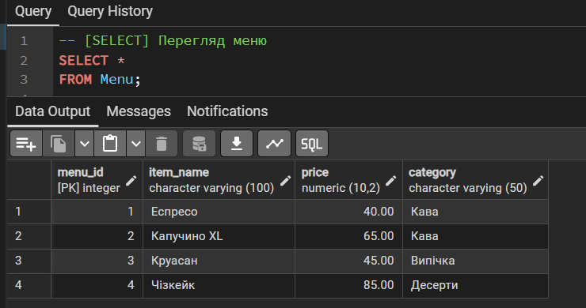<br>
  <i>Рисунок 1 - Вивели меню</i>
</p>

```
SELECT item_name, price 
FROM Menu
WHERE category = 'Кава'
AND price > 50;
```

<p align="center">
  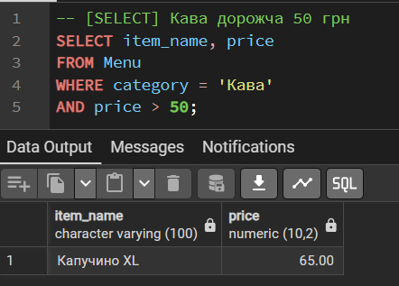<br>
  <i>Рисунок 2 – Пошук кави з великою вартістю </i>
</p>

```
SELECT item_name, price, category
FROM Menu
WHERE price < 55.00;
```

<p align="center">
  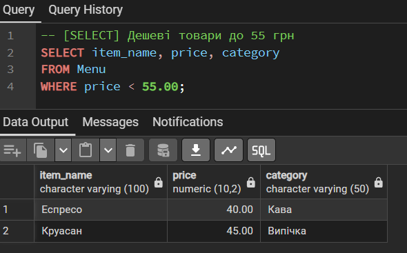<br>
  <i>Рисунок 3 – Перегляд дешевих товарів</i>
</p>

```
-- Додавання нових позицій меню (сценарій: два менеджери паралельно додали нові позиції)
INSERT INTO Menu (item_name, price, category)
VALUES ('Пончікі від Порєва В.М.', 2.00, 'Випічка'), ('Паляніца з сосичкою', 28.00, 'Випічка'), ('Хліб укрАїнський', 30.00, 'Їжа'); 

INSERT INTO Menu (item_name, price, category)
VALUES ('Морозиво шоколадне (Рудь)', 20, 'Десерти'), ('Пончікі від Порєва В.М.', 2.00, 'Випічка'), ('Паляніца з сосичкою', 28.00, 'Випічка'), ('Хліб укрАїнський', 30.00, 'Їжа'); 
```

```
-- Зміна цін на випічку і відповідне позначення
UPDATE Menu
SET price = price * 0.80, item_name = '[АКЦІЯ] | ' || item_name
WHERE category = 'Випічка';
```

```
-- Видалення помилково доданих позицій (перше видалить усі)
DELETE FROM Menu
WHERE item_name IN ('[АКЦІЯ] | Пончікі від Порєва В.М.', '[АКЦІЯ] | Паляніца з сосичкою', 'Хліб укрАїнський');

SELECT *
FROM Menu;
```

<p align="center">
  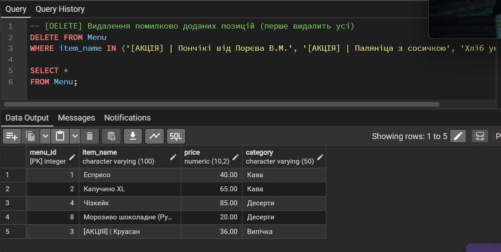<br>
  <i>Рисунок 4 – Видалення помилкових позицій</i>
</p>

```
INSERT INTO Menu (item_name, price, category)
VALUES ('Пончікі від Порєва В.М.', 2.00, 'Випічка'), ('Паляніца з сосичкою', 28.00, 'Випічка'), ('Хліб укрАїнський', 30.00, 'Їжа'); 

-- [SELECT] Перевірка меню
SELECT *
FROM Menu;
```

<p align="center">
  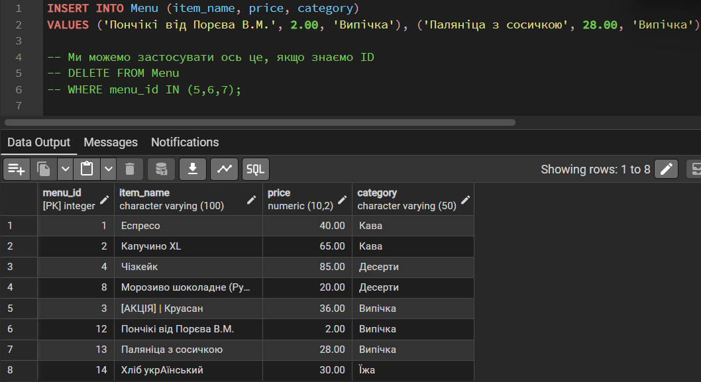<br>
  <i>Рисунок 5 – Зміни та вивід меню</i>
</p>

### Ситуація 2
```
-- Перегляд клієнтів
SELECT *
FROM Clients;
```

<p align="center">
  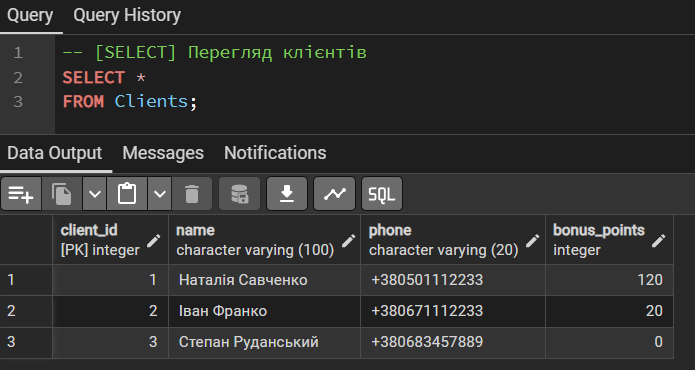<br>
  <i>Рисунок 6 - Вивели клієнтів</i>
</p>

```
-- Реєстрація нового клієнта
INSERT INTO Clients(name, phone)
VALUES ('Альона Кравченко', '+380978941122');

SELECT *
FROM Clients;
```

<p align="center">
  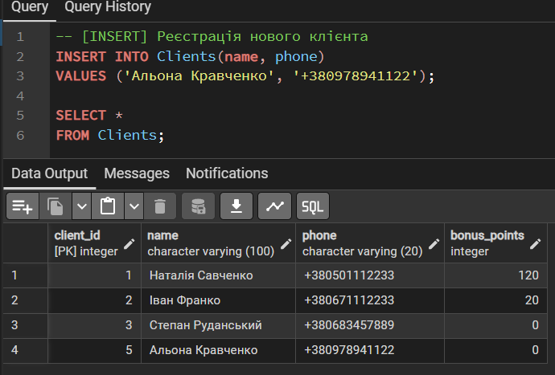<br>
  <i>Рисунок 7 – Реєстрація нового клієнта</i>
</p>

```
-- Нарахування бонусів клієнту
UPDATE Clients
SET bonus_points = bonus_points + 50
WHERE phone = '+380671112233';
```

<p align="center">
  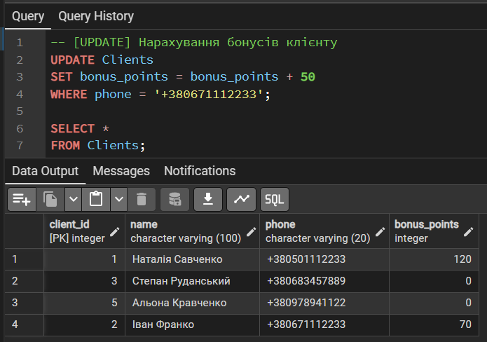<br>
  <i>Рисунок 8 – Нарахування бонусів</i>
</p>

```
-- Обнулення бонусів клієнта
UPDATE Clients 
SET bonus_points = 0
WHERE name = 'Наталія Савченко';
```

<p align="center">
  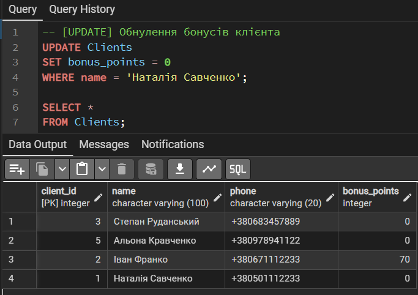<br>
  <i>Рисунок 9 – Оновлення бонусів клієнта</i>
</p>

```
-- Видалення неактивного клієнта
DELETE FROM Clients
WHERE phone = '+380683457889' AND bonus_points = 0;

-- Перевірка клієнтів
SELECT *
FROM Clients;
```

<p align="center">
  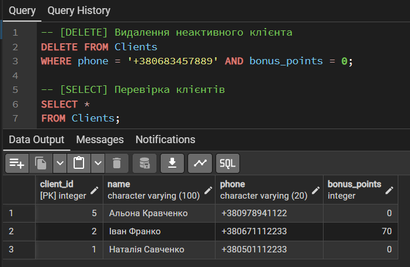<br>
  <i>Рисунок 10 – Видалення неактивного клієнта</i>
</p>

### Ситуація 3

```
-- Перевірка постачальників
SELECT *
FROM Suppliers;
```

<p align="center">
  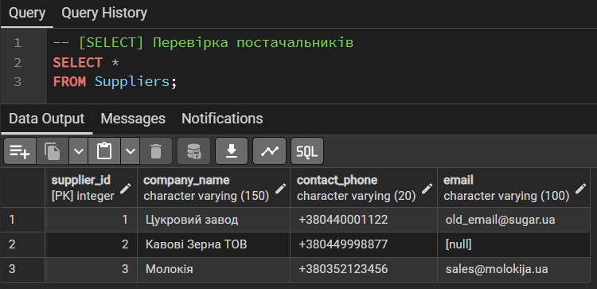<br>
  <i>Рисунок 11 – Перевірка постачальників</i>
</p>

```
-- Постачальники без email
SELECT * 
FROM Suppliers
WHERE email IS NULL;
```

<p align="center">
  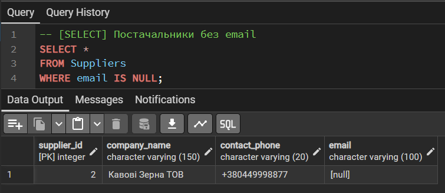<br>
  <i>Рисунок 12 – Пошук постачальників без email</i>
</p>

```
-- Внесення в систему реквізитів нового постачальника
INSERT INTO Suppliers (company_name, phone, email)
VALUES ('ТМ РУДЬ', '+380441234567', 'sales@ryd.ua');

SELECT *
FROM Suppliers;
```

<p align="center">
  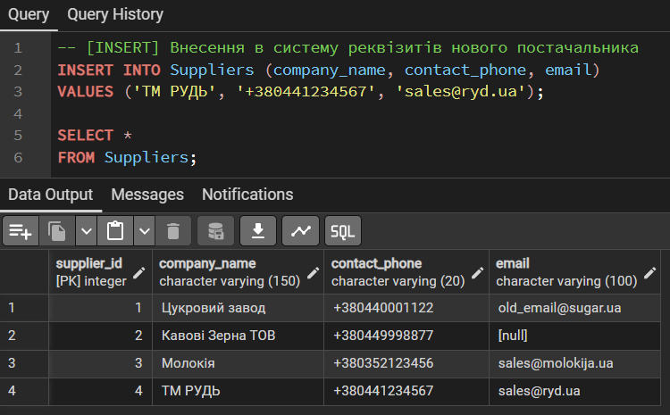<br>
  <i>Рисунок 13 – Внесення в систему реквізитів нового постачальника</i>
</p>

```
-- Фіксація зміни контактних даних у діючого партнера
UPDATE Suppliers
SET email = 'new_contact@sugar.ua'
WHERE company_name = 'Цукровий завод';

SELECT *
FROM Suppliers;
```

<p align="center">
  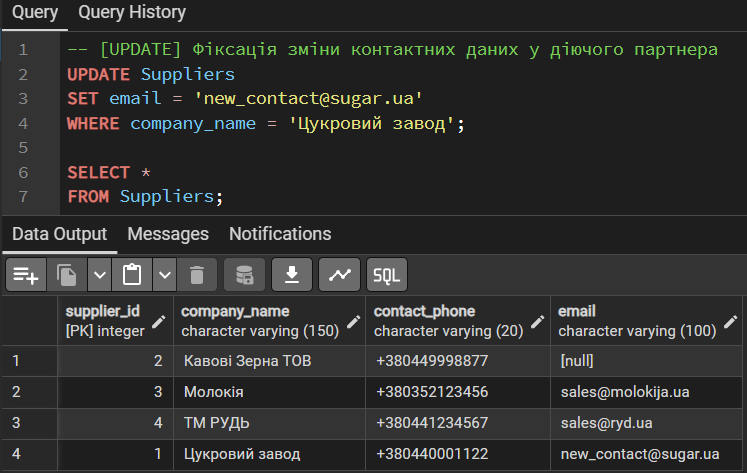<br>
  <i>Рисунок 14 – Фіксація зміни контактних даних у діючого партнера</i>
</p>

```
-- Видалення постачальника
DELETE FROM Suppliers 
WHERE company_name = 'Цукровий завод';
```

```
-- Перевірка постачальників
SELECT *
FROM Suppliers;
```

<p align="center">
  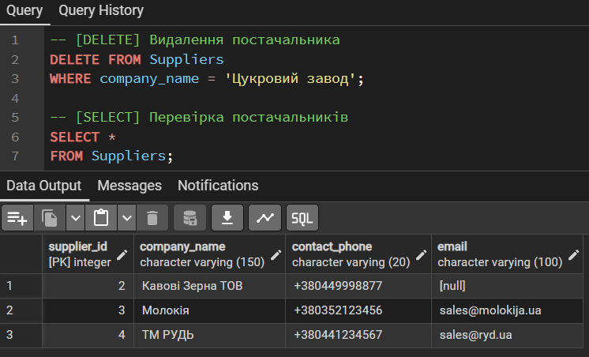<br>
  <i>Рисунок 15 – Видалення постачальника та перевірка данних</i>
</p>

### Ситуація 4

```
-- Критичні залишки інгредієнтів
SELECT i.name, inv.quantity_in_stock, i.min_stock_level
FROM Ingredients i
JOIN Inventory inv ON i.ingredient_id = inv.ingredient_id
WHERE inv.quantity_in_stock < i.min_stock_level;
```

<p align="center">
  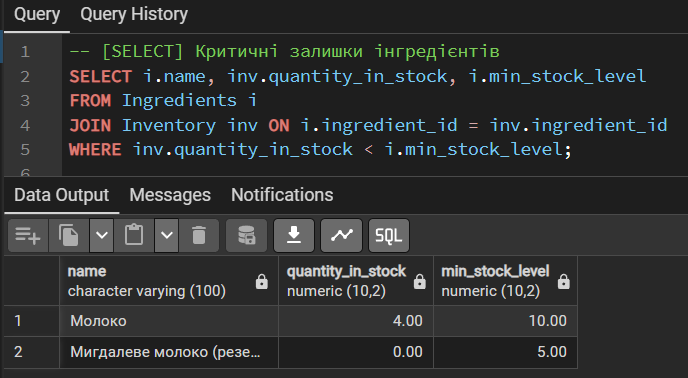<br>
  <i>Рисунок 16 – Перевірка критичних залишків інгредієнтів</i>
</p>


```
-- Фіксація поповнення залишків на складі після прийому товару
UPDATE Inventory
SET quantity_in_stock = quantity_in_stock + 20
WHERE ingredient_id = 1;

SELECT *
FROM Ingredients;

DELETE FROM Ingredients
WHERE name = 'Сироп Диня';

SELECT *
FROM Ingredients;
```

<p align="center">
  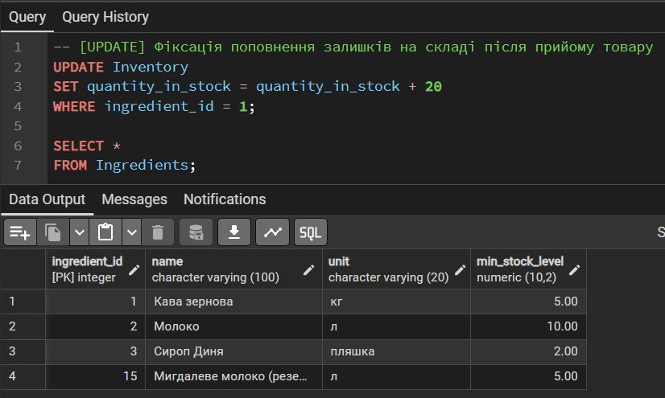<br>
  <i>Рисунок 17 – Фіксація поповнення залишків на складі після прийому товару</i>
</p>

```
-- Додавання нового інгредієнта
INSERT INTO Ingredients (name, unit, min_stock_level)
VALUES ('Мигдалеве молоко', 'л', 7);
```

<p align="center">
  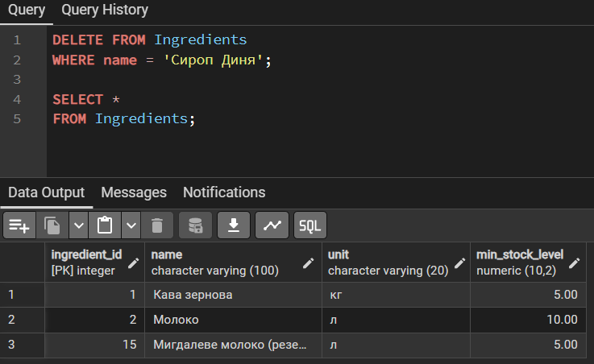<br>
  <i>Рисунок 18 – Додавання нового інгредієнта</i>
</p>

```
-- Перевірка інгредієнтів
SELECT *
FROM Ingredients;
```

<p align="center">
  <br>
  <i>Рисунок 19 – Перевірка інгредієнтів</i>
</p>

# Висновки 
Отже, під час виконання лабораторної роботи ми 