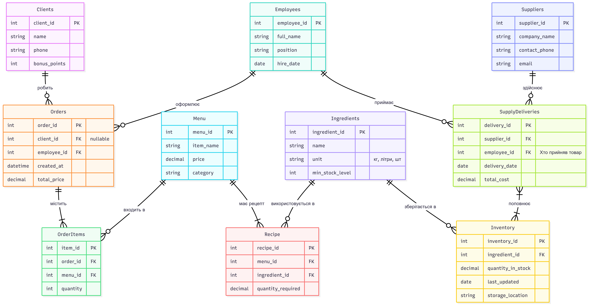

# Лабораторна робота №3

<div align="right">
<strong>Група:</strong> ІО-42

<strong>Виконали:</strong> Бушма Д. О.,
Журавель Б. О.,
Закліковський Є. Д.,
Куліков М. М.  

<strong>Перевірив:</strong> Русінов В. В.
</div>

## **Тема:** 
Маніпулювання даними SQL (OLTP)
## **Мета:** 
- Написати запити `SELECT` для отримання даних (включаючи фільтрацію за допомогою `WHERE` та вибір певних стовпців).
- Практикувати використання операторів `INSERT` для додавання нових рядків до таблиць.
- Практикувати використання оператора `UPDATE` для зміни існуючих рядків (використовуючи `SET` та `WHERE`).
- Практикувати використання операторів `DELETE` для безпечного видалення рядків (за допомогою `WHERE`).
- Вивчити основні операції маніпулювання даними (DML) у PostgreSQL та спостерігати за їхнім впливом.

Промоделюємо декілька ситуацій.

## **Завдання**
#### **Ситуація 1.** Власник кав’ярні вирішив запровадити бюджетне меню для студентів, тому необхідно:
- проаналізувати поточні ціни, щоб знайти найдорожчі позиції в категорії та вже існуючі доступні товари
- додати до меню нові бюджетні позиції
- застосувати масову знижку на певну категорію та додати маркування [АКЦІЯ] до назви акційних страв
- видалити з меню позиції, які не користуються попитом або не відповідають новій ціновій політиці
- перевірити оновлений стан меню після внесених змін

#### **Ситуація 2.** Власник кав’ярні вирішив активніше використовувати бонусну систему, тому необхідно:
- отримати список клієнтів із кількістю бонусних балів
- зареєструвати в системі нових відвідувачів
- нарахувати додаткові бали постійним клієнтам та обнулити рахунки порушникам правил акції
- очистити базу від неактивних клієнтів, які давно не приходили і не мають бонусів
- перевірити оновлений список клієнтів

#### **Ситуація 3.** Власник вирішив оптимізувати співпрацю з постачальниками, тому необхідно:
- отримати перелік постачальників із контактними даними та знайти компанії, у яких відсутні контактні дані (наприклад, email)
- додати нового постачальника до бази
- оновити email або телефон існуючих постачальників
- видалити постачальників, договори з якими розірвано
- перевірити актуальний список постачальників

#### **Ситуація 4.** Менеджер хоче контролювати залишки інгредієнтів, тому необхідно:
- отримати список інгредієнтів, кількість яких нижча за мінімальний рівень (для термінової закупівлі)
- додати нові інгредієнти до системи
- зафіксувати поповнення залишків на складі після прийому товару
- списати інгредієнти, які більше не використовуються
- перевірити стан складу після змін

#### **Ситуація 5.** Менеджер вирішив оновити інформацію про працівників, тому необхідно:
- зробити зріз інформації по діючих працівниках конкретної посади
- оформити в базі нового співробітника
- підвищити посаду одного з працівників
- видалити облікові записи персоналу, який вже звільнився
- перевірити актуальний список співробітників

## **Виконання роботи**
### Ситуація 1


<p align="center">
  <br>
  <i>Рисунок 1 – *</i>
</p>

```
код вводять ось тут
```

### Тестування

<p align="center">
  <br>
  <i>Рисунок 2 – Створені таблиці і типи у PostgreSQL </i>
</p>

<p align="center">
  <br>
  <i>Рисунок 3 – Запит на видачу інформації про замовлення</i>
</p>

<p align="center">
  <br>
  <i>Рисунок 4 – Запит на видачу усіх барист і їх кількість замовлень</i>
</p>

<p align="center">
  <br>
  <i>Рисунок 5 – Запит на видачу інформації про вартість замовлень</i>
</p>


# Висновки 
Отже, під час виконання лабораторної роботи ми 