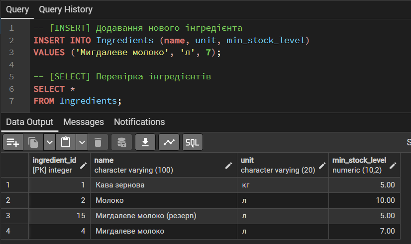
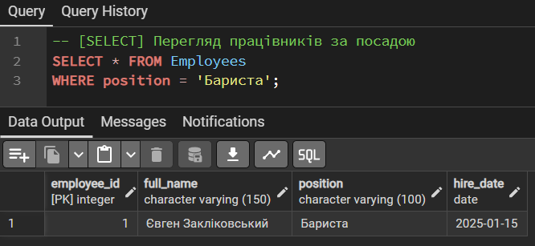
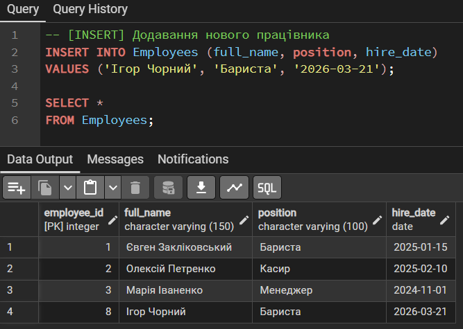
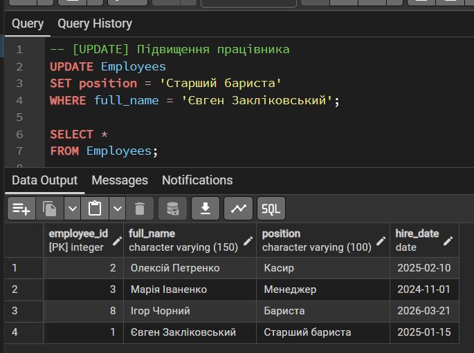
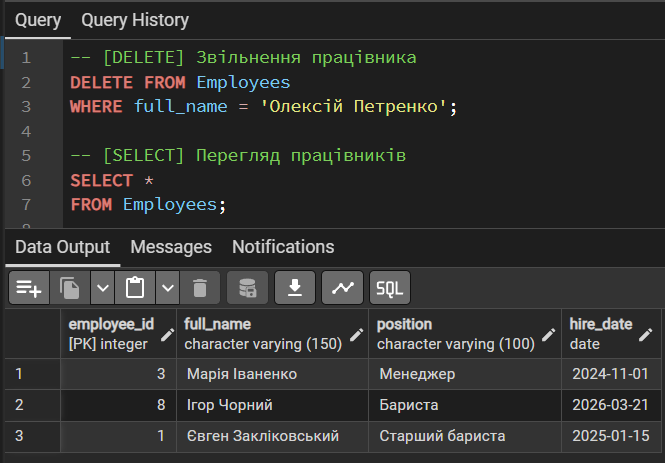

# Лабораторна робота №4

<div align="right">
<strong>Група:</strong> ІО-42

<strong>Виконали:</strong> Бушма Д. О.,
Журавель Б. О.,
Закліковський Є. Д.,
Куліков М. М.  

<strong>Перевірив:</strong> Русінов В. В.
</div>

## **Тема:** 
Аналітичні SQL-запити (OLAP)
## **Мета:** 
- Використовувати агрегатні функції, такі як COUNT, SUM, AVG, MIN та MAX, для обчислення зведеної статистики з ваших даних.
- Написати запити GROUP BY для групування рядків за одним або кількома стовпцями та обчислення агрегатів для кожної групи.
- Використовувати HAVING для фільтрації результатів згрупованих запитів на основі агрегованих умов.
- Виконувати операції JOIN (принаймні INNER JOIN та LEFT JOIN), щоб об'єднати дані з кількох таблиць.
- Створювати об'єднані запити на агрегацію для кількох таблиць, які об'єднують таблиці та створюють згрупований, агрегований вивід.
- Інтерпретувати результати ваших запитів та пояснити, що робить кожен з них.
- Промоделювати декілька ситуацій.

## **Виконання роботи**
### Агрегаційні функції

```
```

<p align="center">
  <br>
  <i>Рисунок 1 - Вивели меню</i>
</p>

```
SELECT item_name, price 
FROM Menu
WHERE category = 'Кава'
AND price > 50;
```

<p align="center">
  <br>
  <i>Рисунок 2 – Пошук кави з великою вартістю </i>
</p>

```
SELECT item_name, price, category
FROM Menu
WHERE price < 55.00;
```

<p align="center">
  <br>
  <i>Рисунок 3 – Перегляд дешевих товарів</i>
</p>

```
-- Додавання нових позицій меню (сценарій: два менеджери паралельно додали нові позиції)
INSERT INTO Menu (item_name, price, category)
VALUES ('Пончікі від Порєва В.М.', 2.00, 'Випічка'), ('Паляніца з сосичкою', 28.00, 'Випічка'), ('Хліб укрАїнський', 30.00, 'Їжа'); 

INSERT INTO Menu (item_name, price, category)
VALUES ('Морозиво шоколадне (Рудь)', 20, 'Десерти'), ('Пончікі від Порєва В.М.', 2.00, 'Випічка'), ('Паляніца з сосичкою', 28.00, 'Випічка'), ('Хліб укрАїнський', 30.00, 'Їжа'); 
```

```
-- Зміна цін на випічку і відповідне позначення
UPDATE Menu
SET price = price * 0.80, item_name = '[АКЦІЯ] | ' || item_name
WHERE category = 'Випічка';
```

```
-- Видалення помилково доданих позицій (перше видалить усі)
DELETE FROM Menu
WHERE item_name IN ('[АКЦІЯ] | Пончікі від Порєва В.М.', '[АКЦІЯ] | Паляніца з сосичкою', 'Хліб укрАїнський');

SELECT *
FROM Menu;
```

<p align="center">
  <br>
  <i>Рисунок 4 – Видалення помилкових позицій</i>
</p>

```
INSERT INTO Menu (item_name, price, category)
VALUES ('Пончікі від Порєва В.М.', 2.00, 'Випічка'), ('Паляніца з сосичкою', 28.00, 'Випічка'), ('Хліб укрАїнський', 30.00, 'Їжа'); 

-- [SELECT] Перевірка меню
SELECT *
FROM Menu;
```

<p align="center">
  <br>
  <i>Рисунок 5 – Зміни та вивід меню</i>
</p>

### Ситуація 2 - Бонусна система клієнтів
```
-- Перегляд клієнтів
SELECT *
FROM Clients;
```

<p align="center">
  <br>
  <i>Рисунок 6 - Вивели клієнтів</i>
</p>

```
-- Реєстрація нового клієнта
INSERT INTO Clients(name, phone)
VALUES ('Альона Кравченко', '+380978941122');

SELECT *
FROM Clients;
```

<p align="center">
  <br>
  <i>Рисунок 7 – Реєстрація нового клієнта</i>
</p>

```
-- Нарахування бонусів клієнту
UPDATE Clients
SET bonus_points = bonus_points + 50
WHERE phone = '+380671112233';
```

<p align="center">
  <br>
  <i>Рисунок 8 – Нарахування бонусів</i>
</p>

```
-- Обнулення бонусів клієнта
UPDATE Clients 
SET bonus_points = 0
WHERE name = 'Наталія Савченко';
```

<p align="center">
  <br>
  <i>Рисунок 9 – Оновлення бонусів клієнта</i>
</p>

```
-- Видалення неактивного клієнта
DELETE FROM Clients
WHERE phone = '+380683457889' AND bonus_points = 0;

-- Перевірка клієнтів
SELECT *
FROM Clients;
```

<p align="center">
  <br>
  <i>Рисунок 10 – Видалення неактивного клієнта</i>
</p>

### Ситуація 3 - Постачалники

```
-- Перевірка постачальників
SELECT *
FROM Suppliers;
```

<p align="center">
  <br>
  <i>Рисунок 11 – Перевірка постачальників</i>
</p>

```
-- Постачальники без email
SELECT * 
FROM Suppliers
WHERE email IS NULL;
```

<p align="center">
  <br>
  <i>Рисунок 12 – Пошук постачальників без email</i>
</p>

```
-- Внесення в систему реквізитів нового постачальника
INSERT INTO Suppliers (company_name, phone, email)
VALUES ('ТМ РУДЬ', '+380441234567', 'sales@ryd.ua');

SELECT *
FROM Suppliers;
```

<p align="center">
  <br>
  <i>Рисунок 13 – Внесення в систему реквізитів нового постачальника</i>
</p>

```
-- Фіксація зміни контактних даних у діючого партнера
UPDATE Suppliers
SET email = 'new_contact@sugar.ua'
WHERE company_name = 'Цукровий завод';

SELECT *
FROM Suppliers;
```

<p align="center">
  <br>
  <i>Рисунок 14 – Фіксація зміни контактних даних у діючого партнера</i>
</p>

```
-- Видалення постачальника
DELETE FROM Suppliers 
WHERE company_name = 'Цукровий завод';
```

```
-- Перевірка постачальників
SELECT *
FROM Suppliers;
```

<p align="center">
  <br>
  <i>Рисунок 15 – Видалення постачальника та перевірка данних</i>
</p>

### Ситуація 4 - Склад інгредієнтів

```
-- Критичні залишки інгредієнтів
SELECT i.name, inv.quantity_in_stock, i.min_stock_level
FROM Ingredients i
JOIN Inventory inv ON i.ingredient_id = inv.ingredient_id
WHERE inv.quantity_in_stock < i.min_stock_level;
```

<p align="center">
  <br>
  <i>Рисунок 16 – Перевірка критичних залишків інгредієнтів</i>
</p>


```
-- Фіксація поповнення залишків на складі після прийому товару
UPDATE Inventory
SET quantity_in_stock = quantity_in_stock + 20
WHERE ingredient_id = 1;

SELECT *
FROM Ingredients;
```

<p align="center">
  <br>
  <i>Рисунок 17 – Фіксація поповнення залишків на складі після прийому товару</i>
</p>

```
DELETE FROM Ingredients
WHERE name = 'Сироп Диня';

SELECT *
FROM Ingredients;
```

<p align="center">
  <br>
  <i>Рисунок 18 – Видалення інгредієнта</i>
</p>

```
-- Додавання нового інгредієнта
INSERT INTO Ingredients (name, unit, min_stock_level)
VALUES ('Мигдалеве молоко', 'л', 7);

-- Перевірка інгредієнтів
SELECT *
FROM Ingredients;
```

<p align="center">
  <br>
  <i>Рисунок 19 – Додавання нового і перевірка інгредієнтів</i>
</p>

### Ситуація 5 - Персонал

```
-- Перегляд працівників за посадою
SELECT * FROM Employees
WHERE position = 'Бариста';
```

<p align="center">
  <br>
  <i>Рисунок 20 – Перегляд працівників за посадою "Бариста"</i>
</p>

```
-- Додавання нового працівника
INSERT INTO Employees (full_name, position, hire_date)
VALUES ('Ігор Чорний', 'Бариста', '2026-03-21');

SELECT *
FROM Employees;
```

<p align="center">
  <br>
  <i>Рисунок 21 – Додавання нового працівника</i>
</p>

```
-- Підвищення працівника
UPDATE Employees 
SET position = 'Старший бариста'
WHERE full_name = 'Євген Закліковський';

SELECT *
FROM Employees;
```

<p align="center">
  <br>
  <i>Рисунок 22 – Демонстрація півищення працівника</i>
</p>

```
-- Звільнення працівника
DELETE FROM Employees
WHERE full_name = 'Олексій Петренко';
```

```
-- Перегляд працівників
SELECT *
FROM Employees;
```

<p align="center">
  <br>
  <i>Рисунок 23 – Звільнення працівника і перевірка особистого складу</i>
</p>

# Висновки

Під час виконання лабораторної роботи ми набули практичних навичок роботи з OLTP запитами у PostgreSQL, реалізувавши типові бізнес-сценарії, у межах яких навчилися виконувати гнучку вибірку даних (SELECT), оновлювати інформацію (UPDATE), додавати записи (INSERT) і коректно видаляти їх (DELETE), а також автоматизувати контроль інвентаризації та персоналу. Цим продемонстровано, що SQL-запити забезпечують ефективне управління оперативною діяльністю підприємства та актуальність даних у системі кав’ярні.