# Лабораторна робота №4

<div align="right">
<strong>Група:</strong> ІО-42

<strong>Виконали:</strong> Бушма Д. О.,
Журавель Б. О.,
Закліковський Є. Д.,
Куліков М. М.  

<strong>Перевірив:</strong> Русінов В. В.
</div>

## **Тема:** 
Аналітичні SQL-запити (OLAP)
## **Мета:** 
- Використовувати агрегатні функції, такі як COUNT, SUM, AVG, MIN та MAX, для обчислення зведеної статистики з ваших даних.
- Написати запити GROUP BY для групування рядків за одним або кількома стовпцями та обчислення агрегатів для кожної групи.
- Використовувати HAVING для фільтрації результатів згрупованих запитів на основі агрегованих умов.
- Виконувати операції JOIN (принаймні INNER JOIN та LEFT JOIN), щоб об'єднати дані з кількох таблиць.
- Створювати об'єднані запити на агрегацію для кількох таблиць, які об'єднують таблиці та створюють згрупований, агрегований вивід.
- Інтерпретувати результати ваших запитів та пояснити, що робить кожен з них.
- Промоделювати декілька ситуацій.

## **Виконання роботи**
## **Виконання роботи**

### Агрегаційні функції

```sql
SELECT COUNT(*) AS total_employees FROM Employees;
```
<p align="center">
  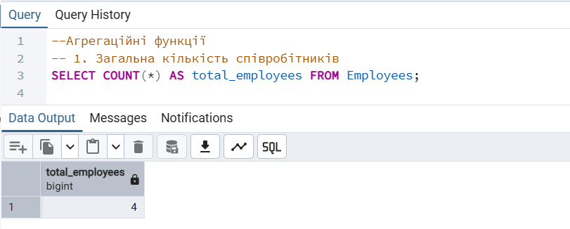<br>
  <i>Рисунок 1 – Загальна кількість співробітників</i>
</p>

```sql
SELECT COUNT(client_id) AS total_clients FROM Clients;
```
<p align="center">
  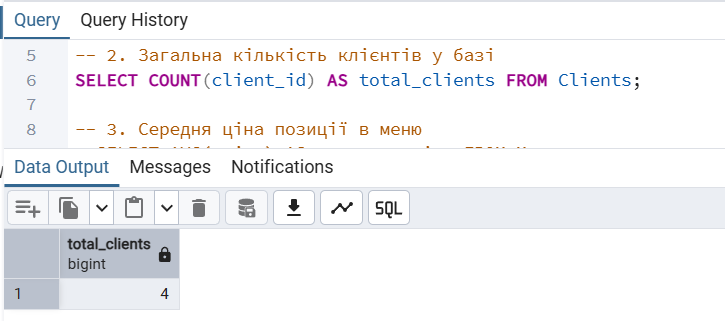<br>
  <i>Рисунок 2 – Кількість клієнтів у базі</i>
</p>

```sql
SELECT AVG(price) AS average_price FROM Menu;
```
<p align="center">
  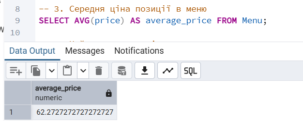<br>
  <i>Рисунок 3 – Середня ціна позицій меню</i>
</p>

```sql
SELECT MAX(price) AS max_price FROM Menu;
```
<p align="center">
  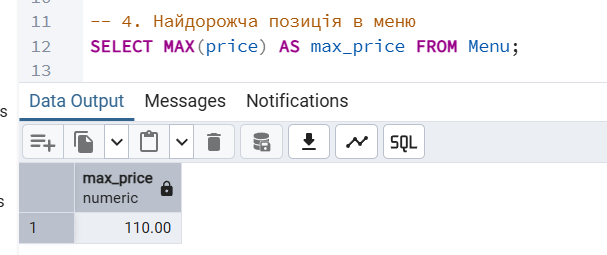<br>
  <i>Рисунок 4 – Найдорожча позиція меню</i>
</p>

```sql
SELECT MIN(bonus_points) FROM Clients WHERE bonus_points > 0;
```
<p align="center">
  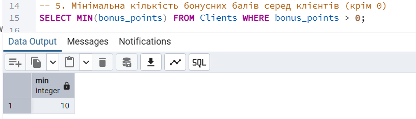<br>
  <i>Рисунок 5 – Мінімальні бонусні бали</i>
</p>

```sql
SELECT SUM(total_price) AS total_revenue FROM Orders;
```
<p align="center">
  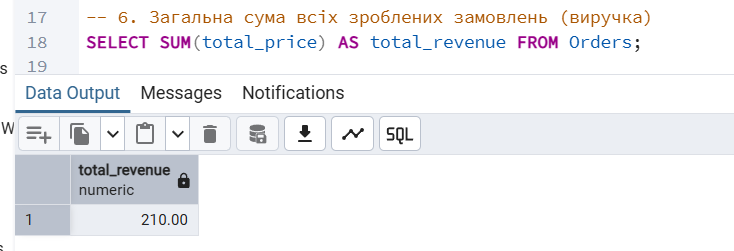<br>
  <i>Рисунок 6 – Загальна виручка</i>
</p>

```sql
SELECT category, COUNT(*) FROM Menu GROUP BY category;
```
<p align="center">
  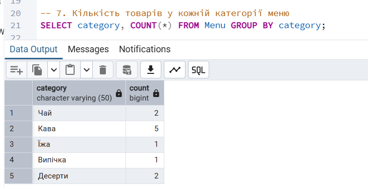<br>
  <i>Рисунок 7 – Кількість товарів по категоріях</i>
</p>

```sql
SELECT category, ROUND(AVG(price), 2) AS avg_price FROM Menu GROUP BY category;
```
<p align="center">
  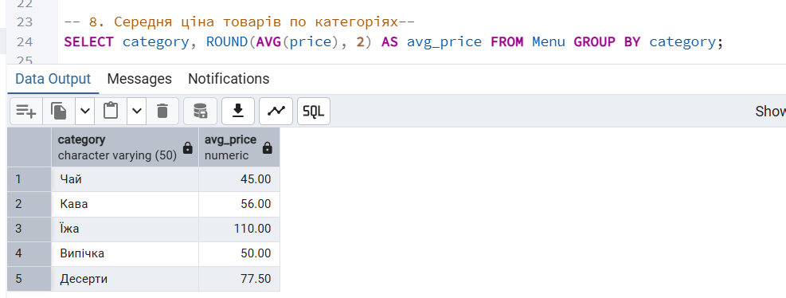<br>
  <i>Рисунок 8 – Середня ціна по категоріях</i>
</p>

```sql
SELECT SUM(bonus_points) FROM Clients;
```
<p align="center">
  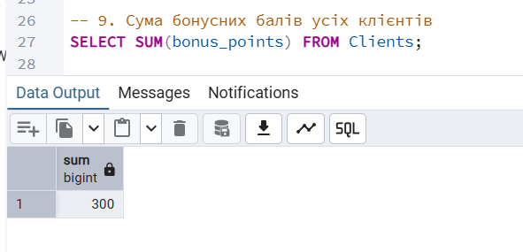<br>
  <i>Рисунок 9 – Сума бонусних балів</i>
</p>

```sql
SELECT employee_id, COUNT(*) AS orders_handled FROM Orders GROUP BY employee_id;
```
<p align="center">
  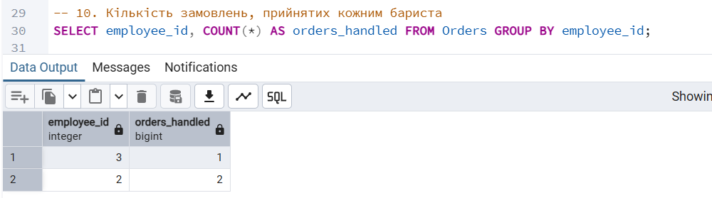<br>
  <i>Рисунок 10 – Кількість замовлень по співробітниках</i>
</p>

```sql
SELECT supplier_id, SUM(total_cost) FROM SupplyDeliveries GROUP BY supplier_id;
```
<p align="center">
  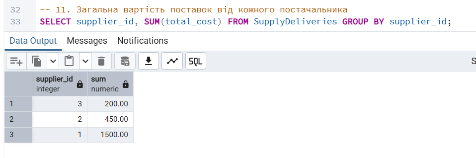<br>
  <i>Рисунок 11 – Загальна вартість поставок по постачальниках</i>
</p>

```sql
SELECT MAX(total_cost) FROM SupplyDeliveries;
```
<p align="center">
  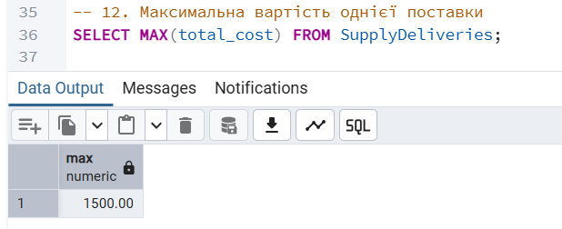<br>
  <i>Рисунок 12 – Максимальна вартість однієї поставки</i>
</p>

```sql
SELECT unit, COUNT(*) FROM Ingredients GROUP BY unit;
```
<p align="center">
  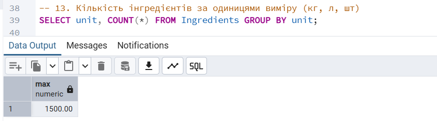<br>
  <i>Рисунок 13 – к-ть Інгредієнтів за одиницями виміру</i>
</p>

```sql
SELECT SUM(quantity_in_stock) FROM Inventory;
```
<p align="center">
  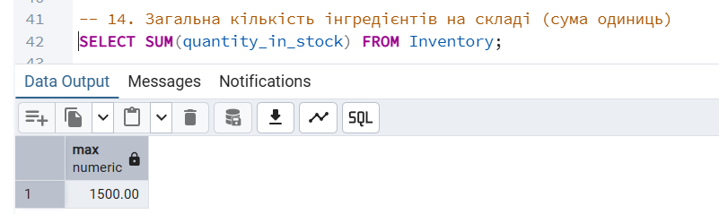<br>
  <i>Рисунок 14 – Загальна кількість інгредієнтів на складі</i>
</p>

```sql
SELECT COUNT(*) FROM Menu WHERE price > 50;
```
<p align="center">
  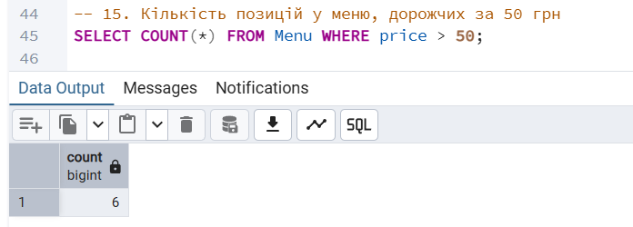<br>
  <i>Рисунок 15 – Кількість товарів, вартість якийї більше 50 грн</i>
</p>

```sql
SELECT category, AVG(price) FROM Menu GROUP BY category HAVING AVG(price) > 60;
```
<p align="center">
  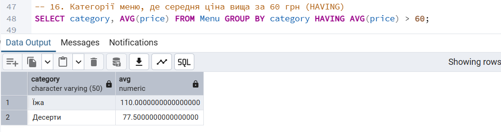<br>
  <i>Рисунок 16 – Категорії, де середня ціна вища 60 гривень</i>
</p>

```sql
SELECT ingredient_id, COUNT(menu_id) FROM Recipe GROUP BY ingredient_id HAVING COUNT(menu_id) > 1;
```
<p align="center">
  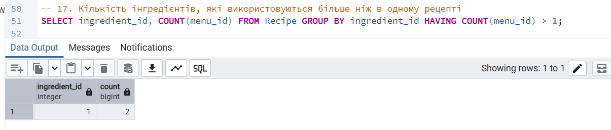<br>
  <i>Рисунок 17 – Інгредієнти, які є у кількох рецептах</i>
</p>

```sql
SELECT employee_id FROM Orders GROUP BY employee_id HAVING COUNT(*) > 2;
```
<p align="center">
  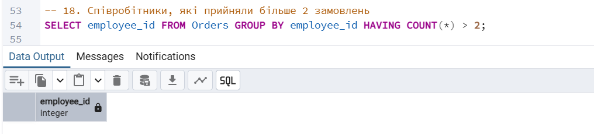<br>
  <i>Рисунок 18 – Активні співробітники, які прийняли більше 2 замовлень</i>
</p>

```sql
SELECT client_id, AVG(total_price) FROM Orders GROUP BY client_id HAVING AVG(total_price) > 50;
```
<p align="center">
  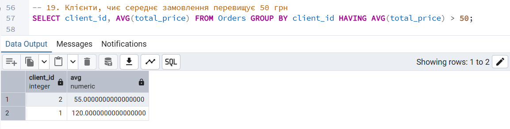<br>
  <i>Рисунок 19 – Клієнти з чеком, сумою більше 50 гривень</i>
</p>

```sql
SELECT menu_id, SUM(quantity) FROM OrderItems GROUP BY menu_id;
```
<p align="center">
  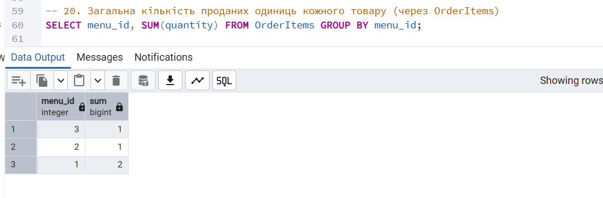<br>
  <i>Рисунок 20 – Кількість проданих одиниць кожного товару</i>
</p>

```sql
SELECT COUNT(*) FROM SupplyDeliveries WHERE EXTRACT(YEAR FROM delivery_date) = 2024;
```
<p align="center">
  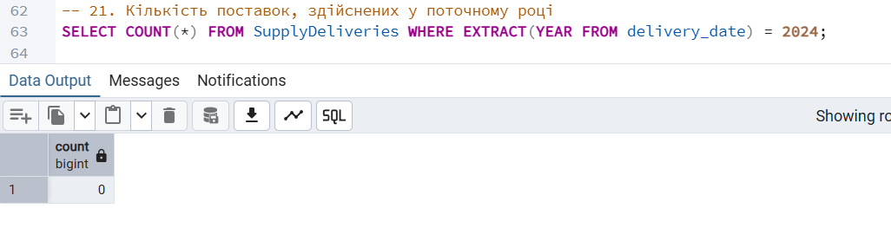<br>
  <i>Рисунок 21 – Кількість поставок у 2024 році</i>
</p>

```sql
SELECT MIN(price) FROM Menu WHERE category = 'Кава';
```
<p align="center">
  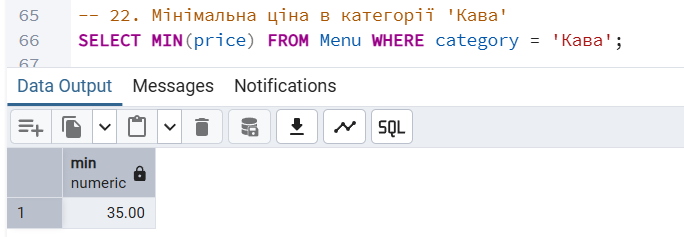<br>
  <i>Рисунок 22 – Мінімальна ціна кави</i>
</p>

```sql
SELECT COUNT(DISTINCT category) FROM Menu;
```
<p align="center">
  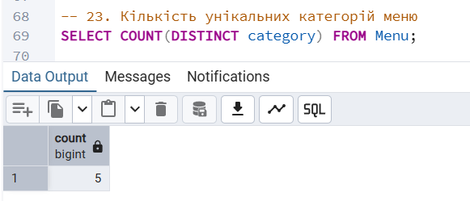<br>
  <i>Рисунок 23 – Кількість унікальних категорій меню</i>
</p>

```sql
SELECT SUM(total_price) / COUNT(*) AS overall_avg_check FROM Orders;
```
<p align="center">
  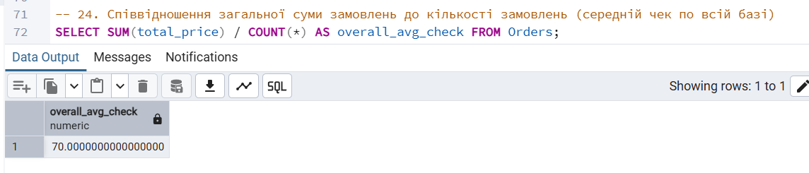<br>
  <i>Рисунок 24 – Середній чек</i>
</p>

---

### Типи джоінтів

```sql
SELECT o.order_id, c.name AS client, e.full_name AS barista, o.total_price
FROM Orders o
JOIN Clients c ON o.client_id = c.client_id
JOIN Employees e ON o.employee_id = e.employee_id;
```
<p align="center">
  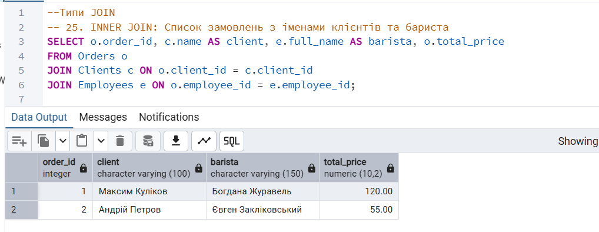<br>
  <i>Рисунок 25 – Замовлення (з клієнтами та баристами, що прийняли дане замовлення)</i>
</p>

```sql
SELECT c.name, o.order_id, o.total_price
FROM Clients c
LEFT JOIN Orders o ON c.client_id = o.client_id;
```
<p align="center">
  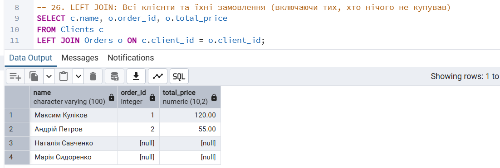<br>
  <i>Рисунок 26 – Клієнти та їх замовлення</i>
</p>

```sql
SELECT i.name, inv.quantity_in_stock
FROM Inventory inv
RIGHT JOIN Ingredients i ON inv.ingredient_id = i.ingredient_id;
```
<p align="center">
  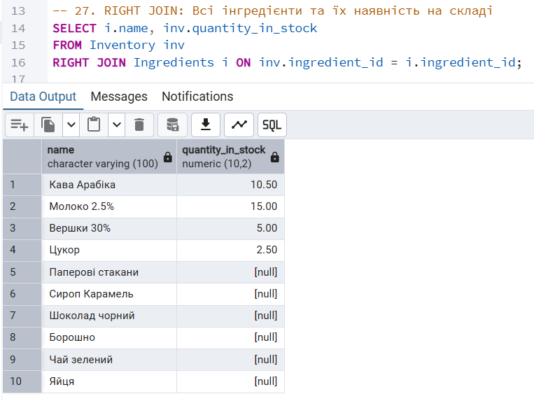<br>
  <i>Рисунок 27 – Інгредієнти на складі</i>
</p>

```sql
SELECT i.name, r.menu_id
FROM Ingredients i
FULL JOIN Recipe r ON i.ingredient_id = r.ingredient_id;
```
<p align="center">
  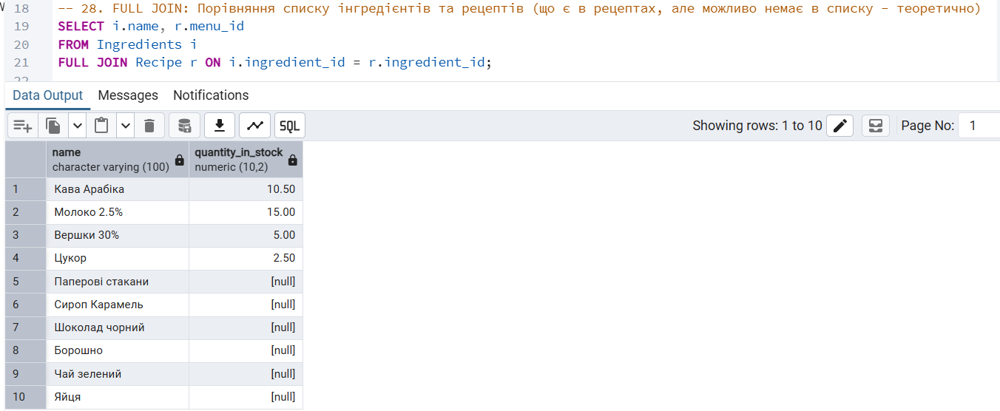<br>
  <i>Рисунок 28 – Порівняння інгредієнтів і рецептів</i>
</p>

```sql
SELECT c.name, m.item_name
FROM Clients c
CROSS JOIN Menu m WHERE m.category = 'Десерти';
```
<p align="center">
  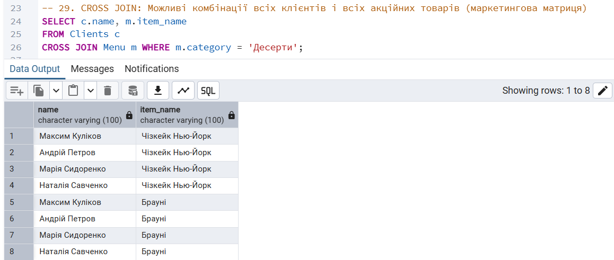<br>
  <i>Рисунок 29 – Комбінації клієнтів і акційних товарів</i>
</p>

```sql
SELECT oi.order_id, m.item_name, oi.quantity, m.price
FROM OrderItems oi
JOIN Menu m ON oi.menu_id = m.menu_id;
```
<p align="center">
  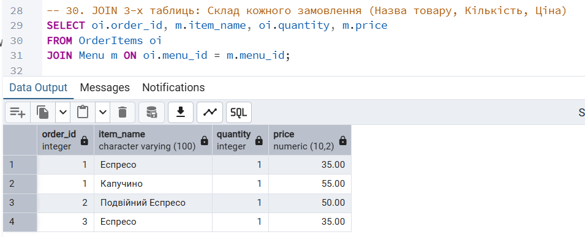<br>
  <i>Рисунок 30 – Склад замовлень</i>
</p>

```sql
SELECT m.item_name, i.name AS ingredient, r.quantity_required
FROM Recipe r
JOIN Menu m ON r.menu_id = m.menu_id
JOIN Ingredients i ON r.ingredient_id = i.ingredient_id;
```
<p align="center">
  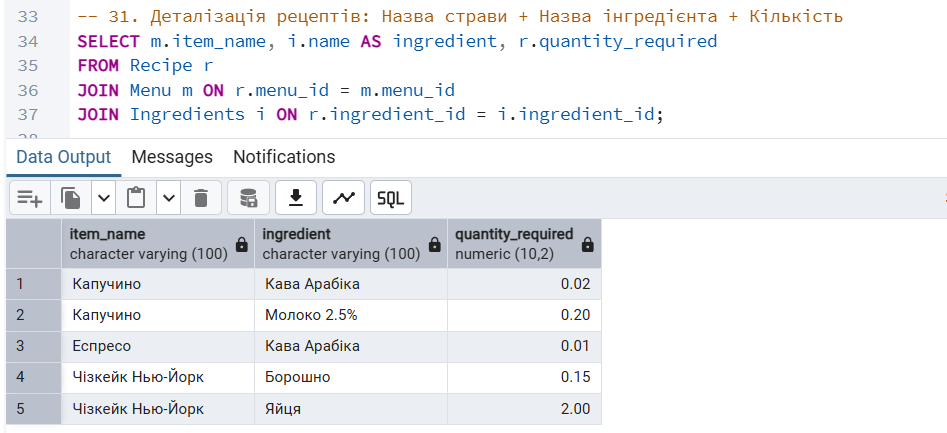<br>
  <i>Рисунок 31 – Рецепти страв</i>
</p>

```sql
SELECT s.company_name, e.full_name AS manager, sd.total_cost, sd.delivery_date
FROM SupplyDeliveries sd
JOIN Suppliers s ON sd.supplier_id = s.supplier_id
JOIN Employees e ON sd.employee_id = e.employee_id;
```
<p align="center">
  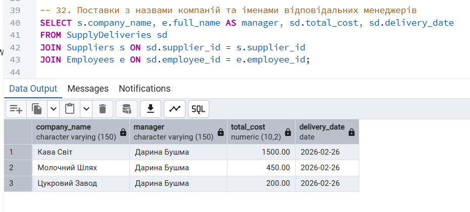<br>
  <i>Рисунок 32 – Поставки і менеджери</i>
</p>

```sql
SELECT i.name, inv.quantity_in_stock
FROM Ingredients i
JOIN Inventory inv ON i.ingredient_id = inv.ingredient_id
WHERE inv.storage_location = 'Холодильник 1';
```
<p align="center">
  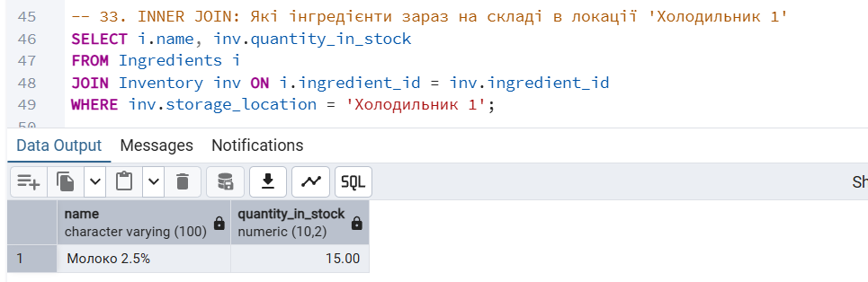<br>
  <i>Рисунок 33 – Інгредієнти в холодильнику</i>
</p>

```sql
SELECT c.name, SUM(o.total_price) AS total_spent
FROM Clients c
JOIN Orders o ON c.client_id = o.client_id
GROUP BY c.name;
```
<p align="center">
  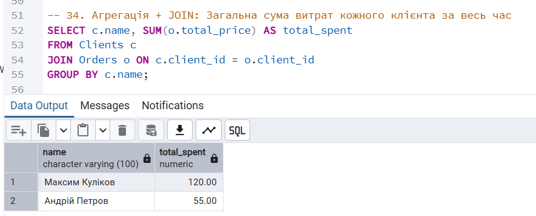<br>
  <i>Рисунок 34 – Витрати клієнтів (за весь час)</i>
</p>

```sql
SELECT s.company_name, SUM(sd.total_cost) AS volume
FROM Suppliers s
JOIN SupplyDeliveries sd ON s.supplier_id = sd.supplier_id
GROUP BY s.company_name
ORDER BY volume DESC;
```
<p align="center">
  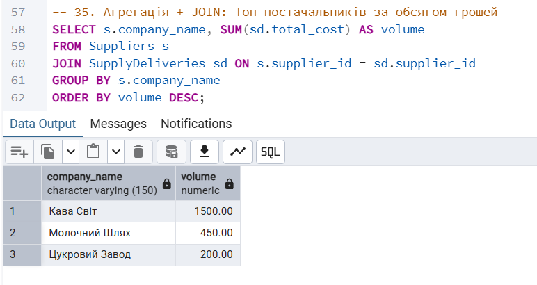<br>
  <i>Рисунок 35 – Топ постачальників (за обсягом коштів)</i>
</p>

```sql
SELECT e.full_name
FROM Employees e
LEFT JOIN Orders o ON e.employee_id = o.employee_id
WHERE o.order_id IS NULL;
```
<p align="center">
  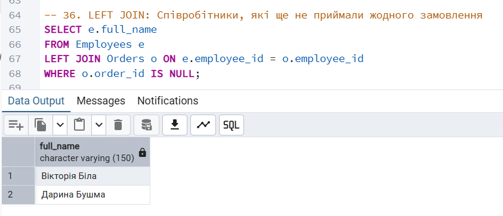<br>
  <i>Рисунок 36 – Співробітники без замовлень</i>
</p>

```sql
SELECT s.company_name, i.name
FROM Suppliers s
JOIN Ingredients i ON i.name LIKE '%Кава%'
WHERE s.company_name = 'Кава Світ';
```
<p align="center">
  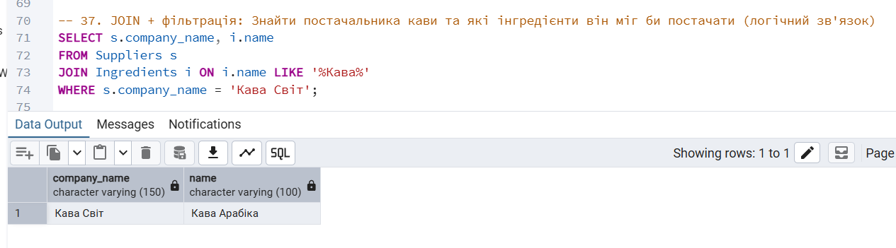<br>
  <i>Рисунок 37 – Постачальник кави</i>
</p>

```sql
SELECT e1.full_name AS Staff, e2.full_name AS Manager
FROM Employees e1
JOIN Employees e2 ON e2.position = 'Менеджер'
WHERE e1.position = 'Бариста';
```
<p align="center">
  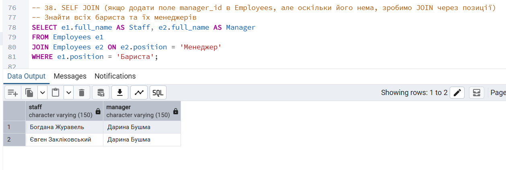<br>
  <i>Рисунок 38 – Баристи та їх менеджери</i>
</p>

```sql
SELECT m.item_name, i.name AS main_ingred, inv.quantity_in_stock
FROM Menu m
JOIN Recipe r ON m.menu_id = r.menu_id
JOIN Ingredients i ON r.ingredient_id = i.ingredient_id
JOIN Inventory inv ON i.ingredient_id = inv.ingredient_id;
```
<p align="center">
  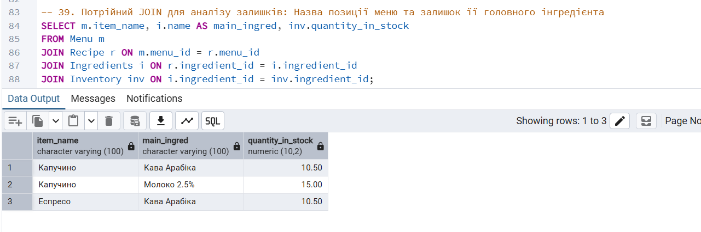<br>
  <i>Рисунок 39 – Залишки інгредієнтів</i>
</p>

---

### Використання підзапитів

```sql
SELECT item_name, price 
FROM Menu 
WHERE price > (SELECT AVG(price) FROM Menu);
```
<p align="center">
  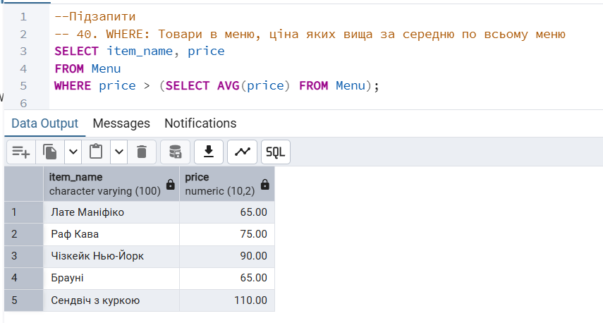<br>
  <i>Рисунок 40 – Товари дорожчі за середню ціну по всьому меню</i>
</p>

```sql
SELECT name 
FROM Clients 
WHERE client_id IN (SELECT client_id FROM Orders WHERE total_price > 100);
```
<p align="center">
  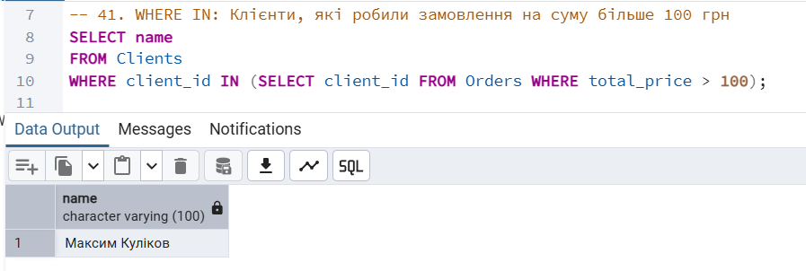<br>
  <i>Рисунок 41 – Клієнти з замовленнями на суму більше 100 гривень</i>
</p>

```sql
SELECT item_name, price, 
      (SELECT MAX(price) FROM Menu) - price AS price_diff
FROM Menu;
```
<p align="center">
  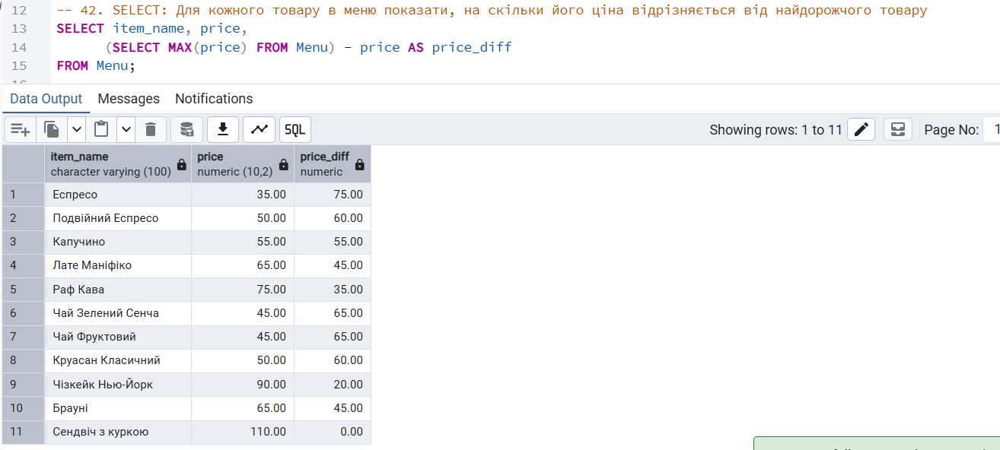<br>
  <i>Рисунок 42 – Різниця вартості товару з максимальною ціною</i>
</p>

```sql
SELECT AVG(ingred_count) 
FROM (SELECT menu_id, COUNT(*) AS ingred_count FROM Recipe GROUP BY menu_id) AS counts;
```
<p align="center">
  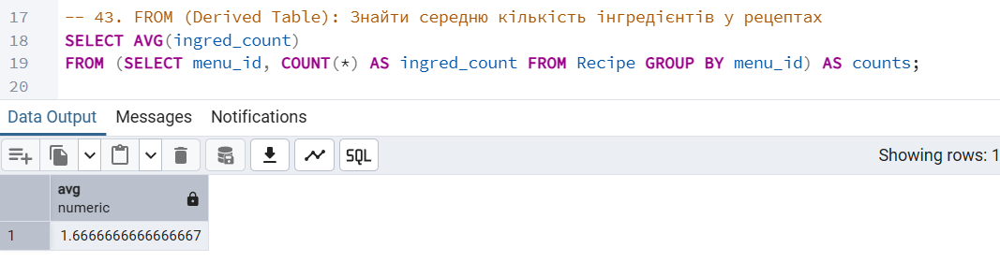<br>
  <i>Рисунок 43 – Середня кількість інгредієнтів</i>
</p>

```sql
SELECT company_name 
FROM Suppliers s
WHERE EXISTS (SELECT 1 FROM SupplyDeliveries sd WHERE sd.supplier_id = s.supplier_id AND sd.total_cost > 1000);
```
<p align="center">
  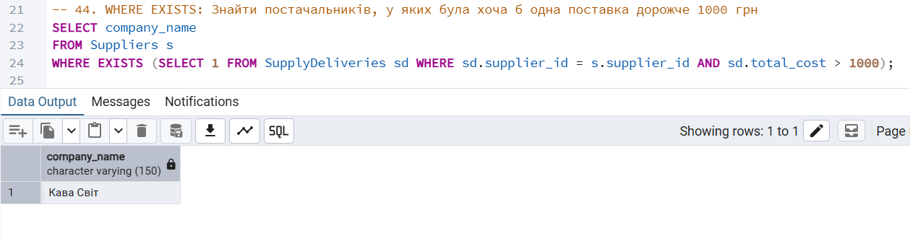<br>
  <i>Рисунок 44 – Постачальники з поставками більше 1000 гривень</i>
</p>

```sql
SELECT category, COUNT(*) 
FROM Menu 
GROUP BY category 
HAVING COUNT(*) > (SELECT COUNT(*) FROM Menu WHERE category = 'Чай');
```
<p align="center">
  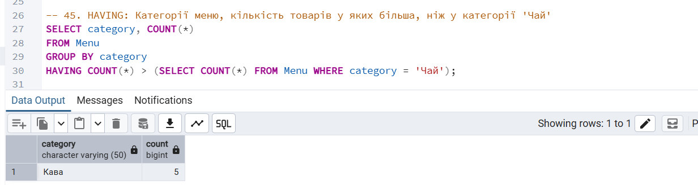<br>
  <i>Рисунок 45 – Категорії, де кількість товарів більша за категорію "чай"</i>
</p>

```sql
SELECT name, 
       (SELECT MAX(created_at) FROM Orders o WHERE o.client_id = c.client_id) AS last_order_date
FROM Clients c;
```
<p align="center">
  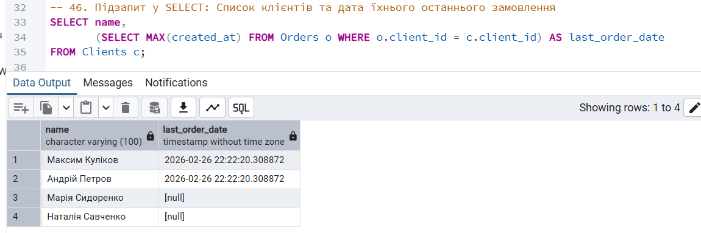<br>
  <i>Рисунок 46 – Останні замовлення клієнтів</i>
</p>

```sql
SELECT i.name, inv.quantity_in_stock
FROM Ingredients i
JOIN Inventory inv ON i.ingredient_id = inv.ingredient_id
WHERE inv.quantity_in_stock < (
    SELECT AVG(inv2.quantity_in_stock) 
    FROM Inventory inv2 
    JOIN Ingredients i2 ON inv2.ingredient_id = i2.ingredient_id 
    WHERE i2.unit = i.unit
);
```
<p align="center">
  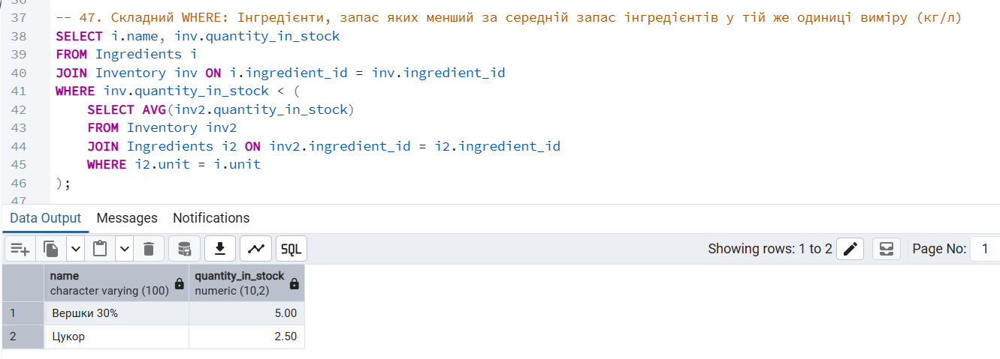<br>
  <i>Рисунок 47 – Інгредієнти нижче середнього запасу</i>
</p>

```sql
SELECT full_name 
FROM Employees 
WHERE employee_id = (
    SELECT employee_id 
    FROM Orders 
    GROUP BY employee_id 
    ORDER BY SUM(total_price) DESC 
    LIMIT 1
);
```
<p align="center">
  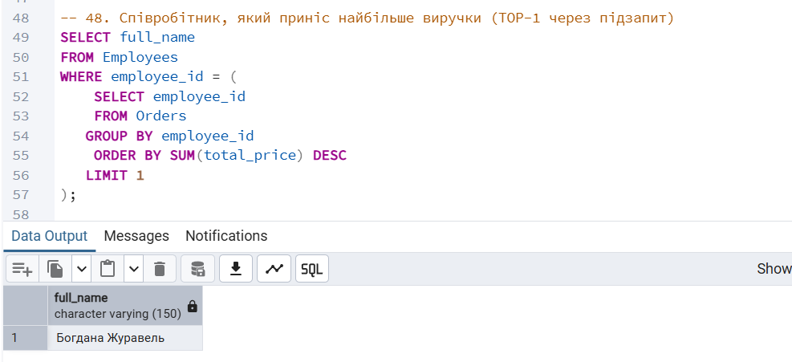<br>
  <i>Рисунок 48 – Найприбутковіший співробітник</i>
</p>

```sql
SELECT item_name, category, price
FROM Menu m1
WHERE price = (
    SELECT MAX(price) 
    FROM Menu m2 
    WHERE m2.category = m1.category
);
```
<p align="center">
  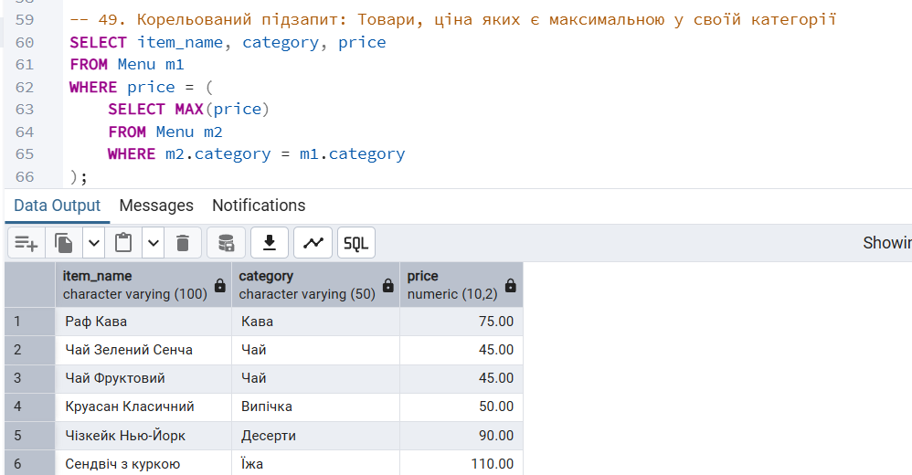<br>
  <i>Рисунок 49 – Найдорожчі товари у категоріях</i>
</p>

# Висновки

Під час виконання лабораторної роботи ми опрацювали основні інструменти аналітичних SQL-запитів у PostgreSQL. Використано агрегатні функції (COUNT, SUM, AVG, MIN, MAX) для отримання узагальнених показників із таблиць бази даних, а також GROUP BY і HAVING для групування та фільтрації агрегованих результатів. Окремо відпрацьовано різні типи JOIN (INNER, LEFT, RIGHT, FULL, CROSS), що дозволило об’єднувати дані з кількох таблиць і аналізувати їх взаємозв’язки. Крім того, застосовано підзапити у SELECT, WHERE та FROM, включно з корельованими, для виконання більш складних аналітичних запитів і порівнянь. У результаті реалізовано набір запитів, які демонструють базові та розширені можливості аналітичної обробки даних у реляційних базах.