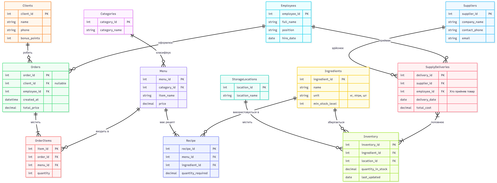

## Аналіз початкової схеми та виявлення аномалій

<p align="center">
  <br>
  <i>Рисунок 1 – Початкова ER-діаграма бази даних кав’ярні</i>
</p>

Під час аналізу бази даних було виявлено надлишковість та аномалії оновлення у двох таблицях: `Menu` та `Inventory`. Текстові дані у цих таблицях постійно дублюються.
* У таблиці `Menu` текстове поле `category` ("Кава", "Чай") повторюється для різних страв. Якщо потрібно перейменувати категорію, доведеться оновлювати безліч рядків (аномалія оновлення).
* У таблиці `Inventory` текстове поле `storage_location` ("Холодильник 1", "Склад") також дублюється для різних інгредієнтів. 

## Функціональні залежності (ФЗ)

Для проблемних таблиць визначено такі функціональні залежності:

**Таблиця Menu:**
* `menu_id` -> `item_name`, `price`, `category`
* Прихована залежність: `category` представляє окрему сутність "Категорія", яка має власну назву. 

**Таблиця Inventory:**
* `inventory_id` -> `ingredient_id`, `quantity_in_stock`, `last_updated`, `storage_location`
* Прихована залежність: `storage_location` представляє окрему сутність "Місце зберігання".

## Перевірка нормальних форм початкової схеми

Початкова схема бази даних знаходиться у **2NF (Другій нормальній формі)**.
* **1NF (Виконується):** Усі атрибути є атомарними. Жодна таблиця не містить масивів, списків або повторюваних груп у межах однієї клітинки.
* **2NF (Виконується):** Таблиця знаходиться в 1NF, і всі проблемні таблиці (`Menu`, `Inventory`) використовують сурогатні первинні ключі (`menu_id`, `inventory_id`), що складаються з одного стовпця. Оскільки складених ключів немає, часткова залежність неможлива — всі неключові атрибути повністю залежать від первинного ключа.
* **3NF (Порушується):** Наявні транзитивні залежності. Атрибути `category` та `storage_location` семантично є окремими сутностями. Їх зберігання у вигляді тексту створює залежність від неключових атрибутів (опосередковано) та призводить до надмірності даних.

## Покрокова нормалізація (Перехід до 3NF)

Щоб привести базу даних до 3NF, потрібно виконати декомпозицію: винести повторювані дані у нові таблиці-довідники та зв'язати їх через зовнішні ключі (Foreign Keys).

### Крок 1: Нормалізація таблиці Menu
1. Створюємо нову таблицю `Categories` з первинним ключем `category_id`.
2. Додаємо поле `category_id` до таблиці `Menu`.
3. Переносимо унікальні значення категорій.
4. Встановлюємо зв'язок (Foreign Key) та видаляємо старе текстове поле.

**Оригінальний дизайн Menu:** `(PK) menu_id`, `item_name`, `price`, `category`
**Перероблений дизайн:** * `Categories`: `(PK) category_id`, `category_name`
* `Menu`: `(PK) menu_id`, `item_name`, `price`, `(FK) category_id`

### Крок 2: Нормалізація таблиці Inventory
1. Створюємо нову таблицю `StorageLocations` з первинним ключем `location_id`.
2. Додаємо поле `location_id` до таблиці `Inventory`.
3. Переносимо унікальні значення місць зберігання.
4. Встановлюємо зв'язок (Foreign Key) та видаляємо старе текстове поле.

**Оригінальний дизайн Inventory:** `(PK) inventory_id`, `ingredient_id`, `quantity_in_stock`, `last_updated`, `storage_location`
**Перероблений дизайн:**
* `StorageLocations`: `(PK) location_id`, `location_name`
* `Inventory`: `(PK) inventory_id`, `ingredient_id`, `quantity_in_stock`, `last_updated`, `(FK) location_id`

## SQL DDL-скрипти (Команди зміни схеми)

Нижче наведено команди для трансформації схеми в базі даних PostgreSQL.

```sql
-- ==========================================
-- 1. ТРАНСФОРМАЦІЯ ТАБЛИЦІ MENU
-- ==========================================

CREATE TABLE IF NOT EXISTS Categories (
    category_id SERIAL PRIMARY KEY,
    category_name VARCHAR(50) NOT NULL UNIQUE
);

ALTER TABLE Menu ADD COLUMN category_id INT;

INSERT INTO Categories (category_name)
SELECT DISTINCT category FROM Menu WHERE category IS NOT NULL;

UPDATE Menu m
SET category_id = c.category_id
FROM Categories c
WHERE m.category = c.category_name;

ALTER TABLE Menu 
    ADD CONSTRAINT fk_menu_category FOREIGN KEY (category_id) REFERENCES Categories(category_id),
    ALTER COLUMN category_id SET NOT NULL;

ALTER TABLE Menu DROP COLUMN category;

-- ==========================================
-- 2. ТРАНСФОРМАЦІЯ ТАБЛИЦІ INVENTORY
-- ==========================================

CREATE TABLE IF NOT EXISTS StorageLocations (
    location_id SERIAL PRIMARY KEY,
    location_name VARCHAR(100) NOT NULL UNIQUE
);

ALTER TABLE Inventory ADD COLUMN location_id INT;

INSERT INTO StorageLocations (location_name)
SELECT DISTINCT storage_location FROM Inventory WHERE storage_location IS NOT NULL;

UPDATE Inventory i
SET location_id = sl.location_id
FROM StorageLocations sl
WHERE i.storage_location = sl.location_name;

ALTER TABLE Inventory 
    ADD CONSTRAINT fk_inventory_location FOREIGN KEY (location_id) REFERENCES StorageLocations(location_id) ON DELETE SET NULL;

ALTER TABLE Inventory DROP COLUMN storage_location;
```

## Результат

<p align="center">
  <br>
  <i>Рисунок 2 – Оновлена нормалізована схема даних</i>
</p>